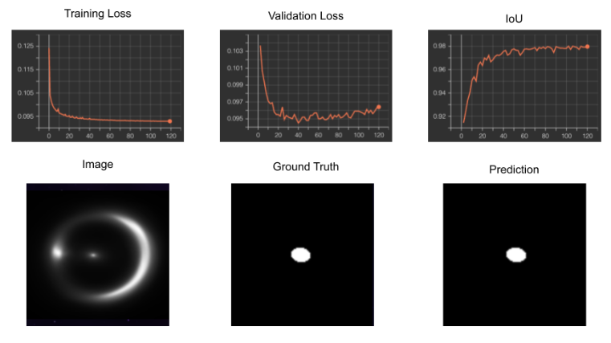
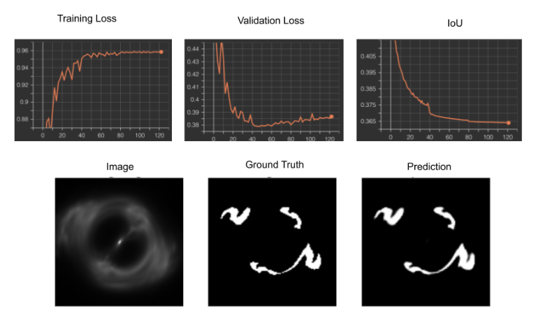
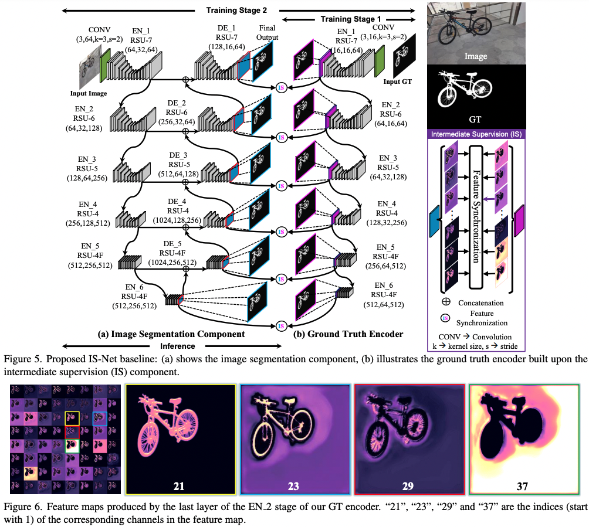

# Finding Gravitational Lens

## What are Gravitational Lenses?

Gravitational Lenses are an observational phenomenon caused by the alignment of two galaxies separated by cosmological distances. The light from the aligned background galaxy bends because of gravitational forces from the foreground galaxy. This causes the light from the background galaxy to appear to us on earth like a halo or Einstein Ring as shown in the diagram and example to the right.

  

Fig 1. Depiction of Gravitional Lensing phenomenon

  

Fig 2. LRG 3-757 Gravitation Lens captured by Hubble Space Telescope's Wide Field Camera 3

## Project Goal

To precisely segment existing Gravitational Lenses in Deep Space to ease and foster scientific research works.

## Results

  

Fig 3. Segmentation Results on the Lens component

  

Fig 4. Segmentation Results on the Arc component

## Model Architecture

We used Nested U2-Net with Intermediate Supervision from https://github.com/xuebinqin/DIS

  

